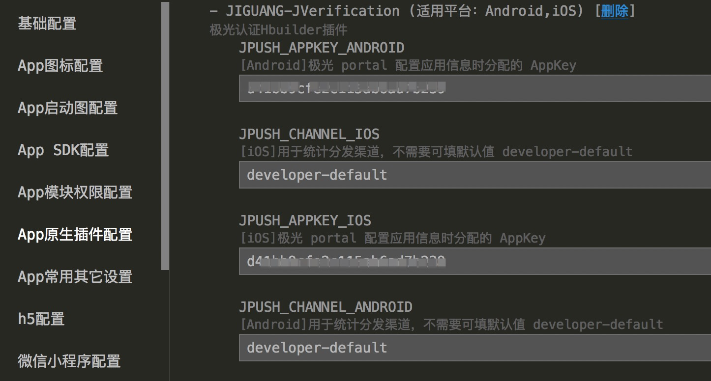
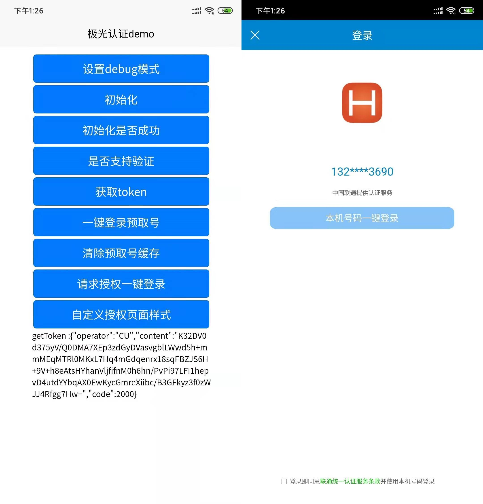

# jverification-hbuilder-plugin

[极光认证](https://www.jiguang.cn/) 官方支持的 Hbuilder 插件（Android & iOS）。是基于 HBuilder 提供的 [uni-app 原生插件扩展](https://ask.dcloud.net.cn/article/35428) 进而开发出的认证插件。开发者可以轻松将极光认证集成到自己的项目中，从而在 js 层实现对认证的控制。

## uniapp插件市场地址
[极光认证官方SDK](https://ext.dcloud.net.cn/plugin?id=1356)

## 接入
- 1.将 nativeplugins/JG-JVerification 导入项目对应位置。
- 2.项目 manifest.json 中接入 JG-JVerification 插件。并配置好 appkey([极光 portal]() 注册分配)，channel 信息。

<p align="center">
    <a target="_blank">
        
    </a>
</p>

- 3.在项目中引用插件
```
const jv = uni.requireNativePlugin('JG-JVerification');
```


## DEMO 体验
按照以下步骤快速体验 JVerification_Hbuilder_demo：
- 1.在[极光 portal](https://www.jiguang.cn/accounts/platform)注册应用并开通认证功能。
- 2.在项目 manifest.json 中配置您申请的极光 appkey 信息
- 3.HbuilderX 中制作打包自定义基座，包名，签名，bundleID 需要与对应 appkey 配置的应用信息保持一致
- 4.HbuilderX 使用自定义基座运行即可

<p align="center">
    <a target="_blank">
        
    </a>
</p>


## API 说明

# JVerification Hbuilder API

## 引用方式
```javascript
const jv = uni.requireNativePlugin('JG-JVerification');
```

## 设置 debug 模式

### API - setDebugMode(Boolean)
开启 debug 模式，请在初始化前调用

#### 参数说明
- true - 开启，false - 关闭

#### 示例
```javascript
jv.setDebugMode(true);
```

## 初始化

### API - init(Object，CALLBACK)
初始化接口

#### 参数说明
- Object

|参数名称|参数类型|参数说明|
|:-----:|:----:|:-----:|
|timeout|number|设置初始化超时时间，单位毫秒，合法范围是(0,30000]，推荐设置为 5000-10000,默认值为 10000。|
|isProduction|boolean|是否生产环境。如果为开发状态，设置为 false；如果为生产状态，应改为 true。可选，默认为 false。（仅作用与 iOS）|
|advertisingId|string|广告标识符，可选。（仅作用与 iOS）|

#### 示例
```javascript
jv.init({
        timeout:7000,
        isProduction:false,
    },result=>{
        let code = result.code
        let desc = result.content
    });
```

## 获取初始化状态

### API - isInitSuccess(CALLBACK)
初始化是否成功

#### 示例
```javascript
jv.isInitSuccess(result=>{
		let isSucc = result.enable;
	})
```

## 判断网络环境是否支持

### API - checkVerifyEnable(CALLBACK)
判断当前网络环境是否可以发起认证

#### 示例
```javascript
jv.checkVerifyEnable(result=>{
		let isSupport = result.enable;
	})
```

## 获取 token

### API - getToken(number，CALLBACK)
初始化接口

#### 参数说明
- number:设置初始化超时时间，单位毫秒，合法范围是(0,30000]，推荐设置为 5000-10000,默认值为 10000。


#### 示例
```javascript
jv.getToken(7000,result=>{
        let code = result.code;
        let token = result.content;
        let operator = result.operator;
    });
```

## 登录预取号

### API - preLogin(number，CALLBACK)
验证当前运营商网络是否可以进行一键登录操作，该方法会缓存取号信息，提高一键登录效率。建议发起一键登录前先调用此方法。

#### 参数说明
- number:设置初始化超时时间，单位毫秒，合法范围是(0,30000]，推荐设置为 5000-10000,默认值为 10000。

#### 示例
```javascript
jv.preLogin(7000,result=>{
        let code = result.code;
        let token = result.content;
    });
```


## 清除预取号缓存

### API - clearPreLoginCache()
清除预取号缓存。

#### 示例
```javascript
jv.clearPreLoginCache();
```

## 请求授权一键登录
- 一键登录需要依赖预取号结果，如果没有预取号，一键登录时会自动预取号。
- 建议拉起授权页前，比如在开屏页或者业务入口页预先调用此接口进行预取号，可以提升授权页拉起速度，优化体验。
- 一键登录请求成功后，不要频繁重复调用。运营商会限制单位时间内请求次数。
- 不要在一键登录回调中重复调用预取号或者拉起授权页接口。

### API - loginAuth(Object，CALLBACK，EVENTCALLBACK)
调起一键登录授权页面，在用户授权后获取 loginToken，同时支持授权页事件监听。

#### 参数说明
- Object

|参数名称|参数类型|参数说明|
|:-----:|:----:|:-----:|
|timeout|number|设置初始化超时时间，单位毫秒，合法范围是(0,30000]，推荐设置为 5000-10000,默认值为 10000。|
|autoFinish|boolean|是否自动关闭授权页，true - 是，false - 否|
|animationFlag|boolean|拉起授权页时是否需要动画效果，true - 是，false - 否，默认 true。（仅作用与 iOS）|

#### 示例
```javascript
jv.loginAuth({
        autoFinish:true,
        timeout:5000
    },result=>{
        // 结果监听
        let code = result.code;
        let loginToken = result.content;
        let operator = result.operator;

    },event=>{
        // 事件监听
        let code = result.code;
        let eventDesc = result.content;
    })
```


## 自定义授权页面样式
iOS 和 Android 分开设置

### API - setCustomUIWithConfigAndroid
修改 Android 授权页面主题，支持传入竖屏和横屏两套config。sdk会根据当前横竖屏状态动态切换，需在 loginAuth 接口之前调用。

#### 接口定义

```javascript
// 设置一个 config 时应用全部
jv.setCustomUIWithConfigAndroid(JVerifyUIConfig)
// 设置两个 config 时，前者应用与竖屏配置，后者应用与横屏配置
jv.setCustomUIWithConfigAndroid(JVerifyUIConfig,JVerifyUIConfig)
```

#### 参数说明
- JVerifyUIConfig（object）:Android 主题配置参数集合，参考[Android JVerifyUIConfig 说明](./doc/ANDROID.md)

#### 示例
```javascript
jv.setCustomUIWithConfigAndroid({
    setNavColor:0xff000000,
    setLogBtnText:" 极光认证测试 ",
    setPrivacyState:false,
    setAppPrivacyColor:[0xff00f000,0xff000000]
})
```

#### API - addCustomViewsClickCallback
添加自定义 view 回调。配合 setCustomUIWithConfigAndroid 的  addCustomViews 属性一起使用

##### 示例
```javascript
jv.addCustomViewsClickCallback(id=>{

})
```

### API - setCustomUIWithConfigiOS
修改 iOS 授权页面主题，需在 loginAuth 接口之前调用。

#### 接口定义

```javascript
jv.setCustomUIWithConfigiOS(JVerifyUIConfig)
```

#### 参数说明
- JVerifyUIConfig（object）:iOS 主题配置参数集合，参考[iOS JVerifyUIConfig 说明](./doc/IOS.md)

#### 示例
```javascript
jv.setCustomUIWithConfigiOS({
    navColor:0xff000000,
    logBtnText:" 极光认证测试 ",
    privacyState:true,
    appPrivacyColor:[0xff000000,0xff000000]
})
```
### API - dismissLoginAuth
隐藏登录页.当授权页被拉起以后，可调用此接口隐藏授权页。当一键登录自动隐藏授权页时，不建议调用此接口。

#### 接口定义
```javascript
jv.dismissLoginAuth(flag)
```
#### 参数说明
- flag:隐藏时是否需要动画。

#### 示例
```javascript
jv.dismissLoginAuth(true)
```

## 获取验证码

### API - getCode
- 获取短信验证码，使用此功能需要在Portal控制台中极光短信模块添加短信签名和验证码短信模版，或者使用默认的签名或模版。详见：[操作指南](https://docs.jiguang.cn//jsms/guideline/JSMS_consoleguide/#_3)
- 通过此接口获得到短信验证码后，需要调用极光验证码验证API来进行验证，详见：[验证码验证 API](https://docs.jiguang.cn//jsms/server/rest_api_jsms/#api_3)

#### 接口定义
```javascript
jv.getCode(object)
```
#### 参数说明
- Object

|参数名称|参数类型|参数说明|
|:-----:|:----:|:-----:|
|phoneNumber|string|电话号码|
|signID|string|短信签名ID，如果为nil，则为默认短信签名ID|
|templateID|string|短信模板ID，如果为nil，则为默认短信模板ID|

#### 示例
```javascript
jv.getCode({
    phoneNumber :  "电话号码",
    signID : "短信签名ID",
    templateID : "短信模板ID"
})
```

## 设置前后两次获取验证码的时间间隔

### API - setTimeWithConfig(number)
设置前后两次获取验证码的时间间隔。

#### 参数说明
- number:默认30000ms，有效范围(0,300000)。

#### 示例
```javascript
jv.setTimeWithConfig(7000);
```


## 错误码

|code|message|备注|
|:-----:|:----:|:-----:|
|1000|verify consistent|手机号验证一致|
|1001|verify not consistent|手机号验证不一致|
|1002|unknown result|未知结果|
|1003|token expired|token失效|
|1004|sdk verify has been closed|SDK 发起认证未开启|
|1005|包名和 AppKey 不匹配|请检查客户端配置的包名与官网对应 Appkey 应用下配置的包名是否一致|
|1006|frequency of verifying single number is beyond the maximum limit|同一号码自然日内认证消耗超过限制|
|1007|beyond daily frequency limit|appKey 自然日认证消耗超过限制|
|1008|AppKey 非法|请到官网检查此应用信息中的 appkey，确认无误|
|1009||请到官网检查此应用的应用详情；更新应用中集成的极光 SDK 至最新|
|1010|verify interval is less than the minimum limit|同一号码连续两次提交认证间隔过短|
|1011|appSign invalid|应用签名错误，检查签名与 Portal 设置的是否一致|
|2000|内容为token|获取 token 成功|
|2001|fetch token failed|获取 token 失败|
|2002|init failed|SDK 初始化失败|
|2003|network not reachable|网络连接不通|
|2004|get uid failed|极光服务注册失败|
|2005|request timeout|请求超时|
|2006|fetch config failed|获取应用配置失败|
|2007|内容为异常信息|验证遇到代码异常|
|2008|Token requesting, please try again later|正在获取 token 中，稍后再试|
|2009|verifying, please try again later|正在认证中，稍后再试 |
|2010|don't have READ_PHONE_STATE permission|未开启读取手机状态权限|
|2011|内容为异常信息|获取配置时代码异常|
|2012|内容为异常信息|获取 token 时代码异常|
|2013|内容为具体错误原因|网络发生异常|
|2014|internal error while requesting token|请求 token 时发生内部错误|
|2016|network type not supported|当前网络环境不支持认证|
|4001|parameter invalid|参数错误。请检查参数，比如是否手机号格式不对|
|4018||没有足够的余额|
|4031||不是认证 SDK 用户|
|4032||获取不到用户配置|
|4033|appkey is not support login|不是一键登录用户|
|5000|bad server|服务器未知错误|
|6000|内容为token|获取 loginToken 成功|
|6001|fetch loginToken failed|获取 loginToken 失败|
|6002|fetch loginToken canceled|用户取消获取 loginToken|
|6003|UI 资源加载异常|未正常添加 sdk 所需的资源文件|
|6004|authorization requesting, please try again later|正在登录中，稍后再试|
|7000|preLogin success|sdk 预取号成功|
|7001|preLogin failed|sdk 预取号失败|
|7002|preLogin requesting, please try again later|正在预取号中，稍后再试|
|-994|网络连接超时|   |
|-996|网络连接断开|   |
|-997|注册失败/登录失败|（一般是由于没有网络造成的）如果确保设备网络正常，还是一直遇到此问题，则还有另外一个原因：JPush 服务器端拒绝注册。而这个的原因一般是：你当前 App 的 Android 包名以及 AppKey，与你在 Portal 上注册的应用的 Android 包名与 AppKey 不相同。|


## 参考资料

[官方文档](https://docs.jiguang.cn/jverification/guideline/intro/)

## Support
- 集成前请先尝试 demo 工程跑通
- 出现问题请先打开 debug 模式，拿到前端和原生日志
- 更多问题请前往[极光社区](http://community.jiguang.cn/)

## 常见问题
- 1.这个sdk100M，会打包到apk吗？
 
  包容量，与打包方式有关， 安卓应该在1M左右，看打包方式；iOS会大一些。可以看我们demo 的大小，
 
  Android demo apk 最多也就 3 M，iOS 是 2.9M。https://docs.jiguang.cn/jverification/resources/#demo。

 - 2.demo跑不起来，脑壳疼。

   a、可以去GitHub上下载demo，用HbuilderX打开JVerification_Hbuilder_Demo文件，在manifest.json文件里面自己生成一个uniapp的appid，这是自动生成的。有的话换成自己的appid。


   b、配置您申请的极光 appkey 信息。


   c、HbuilderX 中制作打包自定义基座。注意：包名，签名，证书，bundleID 需要与对应 appkey 配置的应用信息保持一致。（[极光 portal](https://www.jiguang.cn/accounts/platform)注册分配）


 - 3.初始化老失败。

   一定要填好[极光 portal](https://www.jiguang.cn/accounts/platform)分配的包名，签名，证书，bundleID和appkey，如果没填是初始化不成功的呀。


## License

MIT © [JiGuang](/license)