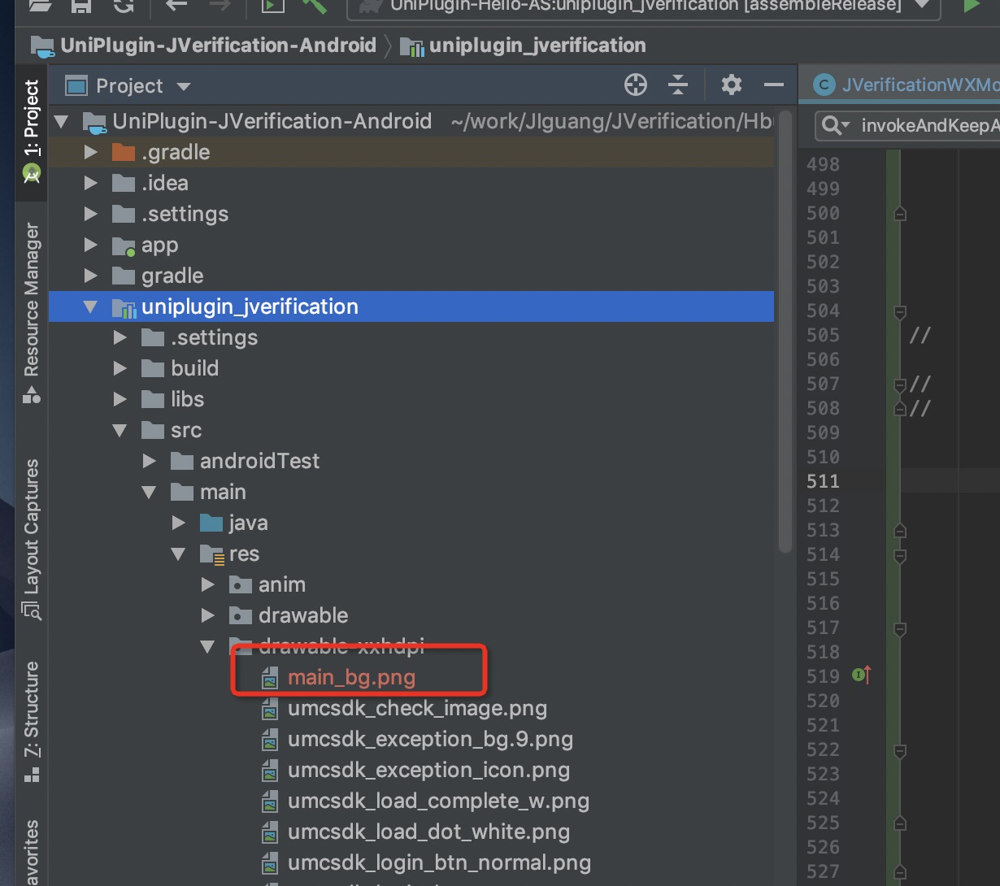
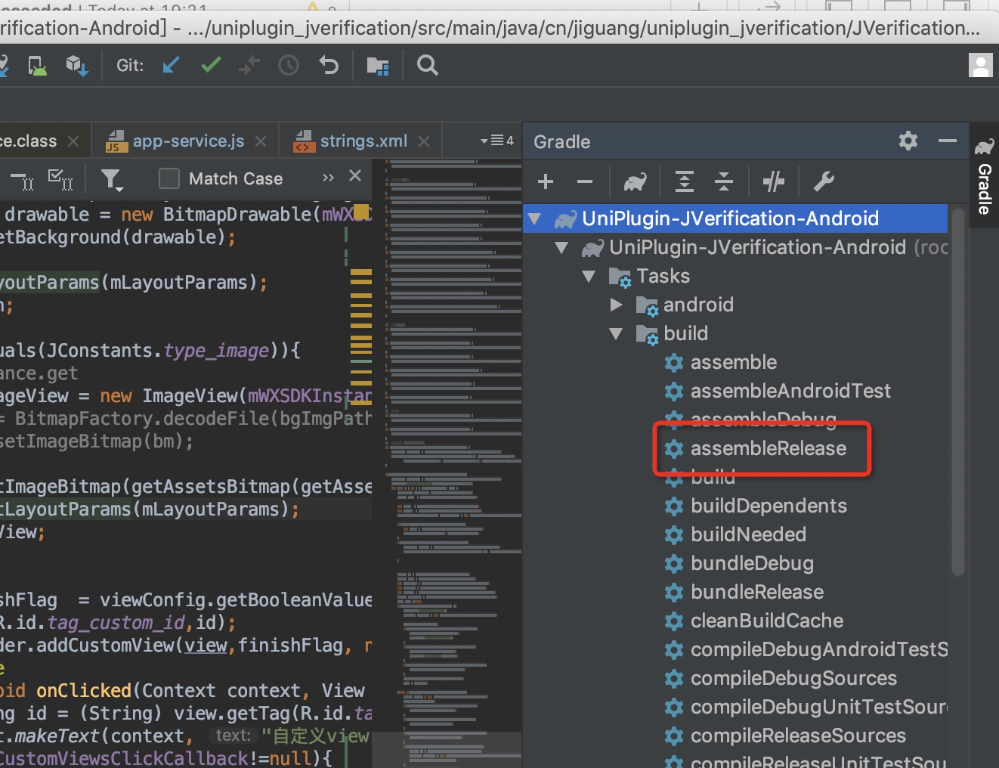
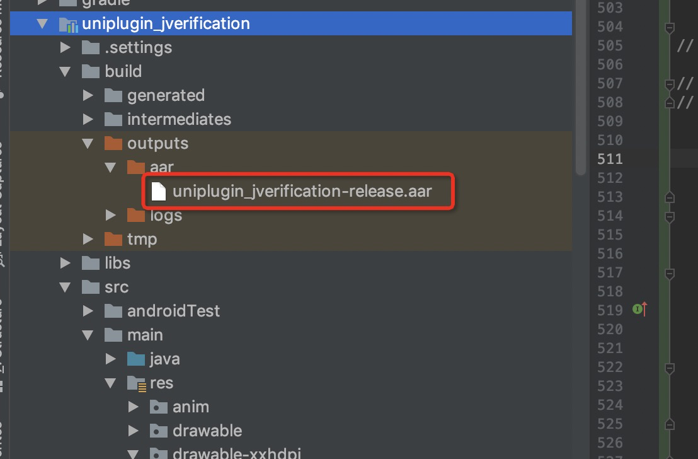

### Andorid 

### JVerifyUIConfig 配置元素说明
 
***x 轴未设置偏移则所有组件默认横向居中***
 
+ 设置授权页背景
+ 支持的版本 ：2.1.1
+ 说明：
+ 图片会默认拉伸铺满整个屏幕，适配不同尺寸手机，建议使用 .9.png 图片来解决适配问题。
 
|方法|参数类型|说明|
|:-----:|:----:|:----:|
|setAuthBGImgPath|String|设置背景图片|
 
 
+ 授权页状态栏
 
|方法|参数类型|说明|
|:-----:|:----:|:----:|
|setStatusBarColorWithNav|boolean|设置状态栏与导航栏同色。仅在 android 5.0 以上设备生效。 since 2.4.1|
|setStatusBarDarkMode|boolean|设置状态栏暗色模式。仅在 android 6.0 以上设备生效。 since 2.4.8|
|setStatusBarTransparent|boolean|设置状态栏是否透明。仅在 android 4.4 以上设备生效。 since 2.4.8|
|setStatusBarHidden|boolean|设置状态栏是否隐藏。since 2.4.8|
|setVirtualButtonTransparent|boolean|设置虚拟按键栏背景是否透明。since 2.5.2|


+ 授权页导航栏

|方法|参数类型|说明|
|:-----:|:----:|:----:|
|setNavColor|int|设置导航栏颜色|
|setNavText|String|设置导航栏标题文字|
|setNavTextColor|int|设置导航栏标题文字颜色|
|setNavReturnImgPath|String|设置导航栏返回按钮图标|
|setNavTransparent|boolean|设置导航栏背景是否透明。默认不透明。since 2.3.2|
|setNavTextSize|int|设置导航栏标题文字字体大小（单位：sp）。since 2.4.1|
|setNavReturnBtnHidden|boolean|设置导航栏返回按钮是否隐藏。默认不隐藏。since 2.4.1|
|setNavReturnBtnWidth|int|设置导航栏返回按钮宽度。since 2.4.8|
|setNavReturnBtnHeight|int|设置导航栏返回按钮高度。since 2.4.8|
|setNavReturnBtnOffsetX|int|设置导航栏返回按钮距屏幕左侧偏移。since 2.4.8|
|setNavReturnBtnRightOffsetX|int|设置导航栏返回按钮距屏幕右侧偏移。since 2.4.8|
|setNavReturnBtnOffsetY|int|设置导航栏返回按钮距上端偏移。since 2.4.8|
|setNavHidden|boolean|设置导航栏是否隐藏。since 2.4.8|

+ 授权页logo

|方法|参数类型|说明|
|:-----:|:----:|:----:|
|setLogoWidth|int|设置logo宽度（单位：dp）|
|setLogoHeight|int|设置logo高度（单位：dp）|
|setLogoHidden|boolean|隐藏logo|
|setLogoOffsetY|int|设置logo相对于标题栏下边缘y偏移|
|setLogoImgPath|String|设置logo图片|
|setLogoOffsetX|int|设置logo相对于屏幕左边x轴偏移。since 2.3.8|
|setLogoOffsetBottomY|int|设置logo相对于屏幕底部y轴偏移。since 2.4.8|

+ 授权页号码栏

|方法|参数类型|说明|
|:-----:|:----:|:----:|
|setNumberColor|int|设置手机号码字体颜色|
|setNumberSize|Number|设置手机号码字体大小（单位：sp）。since 2.3.2|
|setNumFieldOffsetY|int|设置号码栏相对于标题栏下边缘y偏移|
|setNumFieldOffsetX|int|设置号码栏相对于屏幕左边x轴偏移。since 2.3.8|
|setNumberFieldOffsetBottomY|int|设置号码栏相对于屏幕底部y轴偏移。since 2.4.8|
|setNumberFieldWidth|int|设置号码栏宽度。since 2.4.8|
|setNumberFieldHeight|int|设置号码栏高度。since 2.4.8|

+ 授权页登录按钮
 
|方法|参数类型|说明|
|:-----:|:----:|:----:|
|setLogBtnText|String|设置登录按钮文字|
|setLogBtnTextColor|int|设置登录按钮文字颜色|
|setLogBtnImgPath|String|设置授权登录按钮图片|
|setLogBtnOffsetY|int|设置登录按钮相对于标题栏下边缘y偏移|
|setLogBtnOffsetX|int|设置登录按钮相对于屏幕左边x轴偏移。since 2.3.8|
|setLogBtnWidth|int|设置登录按钮宽度。since 2.3.8|
|setLogBtnHeight|int|设置登录按钮高度。since 2.3.8|
|setLogBtnTextSize|int|设置登录按钮字体大小。since 2.3.8|
|setLogBtnBottomOffsetY|int|设置登录按钮相对屏幕底部y轴偏移。since 2.4.8|

+ 授权页隐私栏

|方法|参数类型|说明|
|:-----:|:----:|:----:|
|setAppPrivacyOne|String,String|设置开发者隐私条款1名称和URL(名称，url)|
|setAppPrivacyTwo|String,String|设置开发者隐私条款2名称和URL(名称，url)|
|setAppPrivacyColor|int,int|设置隐私条款名称颜色(基础文字颜色，协议文字颜色)|
|setPrivacyOffsetY|int|设置隐私条款相对于授权页面底部下边缘y偏移|
|setCheckedImgPath|String|设置复选框选中时图片|
|setUncheckedImgPath|String|设置复选框未选中时图片|
|setPrivacyState|boolean|设置隐私条款默认选中状态，默认不选中。since 2.3.2|
|setPrivacyOffsetX|int|设置隐私条款相对于屏幕左边x轴偏移。since 2.3.8|
|setPrivacyTextCenterGravity|boolean|设置隐私条款文字是否居中对齐（默认左对齐）。since 2.3.8|
|setPrivacyText|String,String,String,String|设置隐私条款名称外的文字。<br>如：登录即同意...和...、...并使用本机号码登录<br>参数1为："登录即同意"。<br>参数2为："和"。<br>参数3为："、"。<br>参数4为："并使用本机号码登录"。<br>since 2.3.8|
|setPrivacyTextSize|int|设置隐私条款文字字体大小（单位：sp）。since 2.4.1|
|setPrivacyTopOffsetY|int|设置隐私条款相对导航栏下端y轴偏移。since 2.4.8|
|setPrivacyCheckboxHidden|boolean|设置隐私条款checkbox是否隐藏。since 2.4.8|
|setPrivacyCheckboxSize|int|设置隐私条款checkbox尺寸。since 2.4.8|
|setPrivacyWithBookTitleMark|boolean|设置隐私条款运营商协议名是否加书名号。since 2.4.8|
|setPrivacyCheckboxInCenter|boolean|设置隐私条款checkbox是否相对协议文字纵向居中。默认居顶。since 2.4.8|
|setPrivacyTextWidth|int|设置隐私条款文字栏宽度。since 2.5.0|

+ 授权页隐私协议web页面

|方法|参数类型|说明|
|:-----:|:----:|:----:|
|setPrivacyNavColor|int|设置协议展示web页面导航栏背景颜色。since 2.4.8|
|setPrivacyNavTitleTextColor|int|设置协议展示 web 页面导航栏标题文字颜色。since 2.4.8|
|setPrivacyNavTitleTextSize|int|设置协议展示 web 页面导航栏标题文字大小（sp）。since 2.4.8|
|setAppPrivacyNavTitle1|String|设置自定义协议 1 对应 web 页面导航栏文字内容。since 2.5.2|
|setAppPrivacyNavTitle2|String|设置自定义协议 2 对应 web 页面导航栏文字内容。since 2.5.2|
|setPrivacyStatusBarColorWithNav|boolean|设置授权协议 web 页面状态栏与导航栏同色。仅在android 5.0以上设备生效。since 2.5.2|
|setPrivacyStatusBarDarkMode|boolean|设置授权协议 web 页面状态栏暗色模式。仅在android 6.0以上设备生效。since 2.5.2|
|setPrivacyStatusBarTransparent|boolean|设置授权协议 web 页面状态栏是否透明。仅在android 4.4以上设备生效。since 2.5.2|
|setPrivacyStatusBarHidden|boolean|设置授权协议 web 页面状态栏是否隐藏。since 2.5.2|
|setPrivacyVirtualButtonTransparent|boolean|设置授权协议 web 页面虚拟按键栏背景是否透明。since 2.5.2|

+ 授权页slogan

|方法|参数类型|说明|
|:-----:|:----:|:----:|
|setSloganTextColor|int|设置移动 slogan 文字颜色|
|setSloganOffsetY|int|设置 slogan 相对于标题栏下边缘y偏移|
|setSloganOffsetX|int|设置 slogan 相对于屏幕左边x轴偏移。since 2.3.8|
|setSloganBottomOffsetY|int|设置 slogan 相对于屏幕底部下边缘y轴偏移。since 2.3.8|
|setSloganTextSize|int|设置 slogan 字体大小。since 2.4.8|
|setSloganHidden|boolean|设置 slogan 是否隐藏。since 2.4.8|
              
+ 授权页动画

|方法|参数类型|说明|
|:-----:|:----:|:----:|
|setNeedStartAnim|boolean|设置拉起授权页时是否需要显示默认动画。默认展示。since 2.5.2|
|setNeedCloseAnim|boolean|设置关闭授权页时是否需要显示默认动画。默认展示。since 2.5.2|

+ 弹窗模式

|方法|参数类型|说明|
|:-----:|:----:|:----:|
|setDialogTheme|int,int,int,int,boolean|设置授权页为弹窗模式(窗口宽度，窗口高度，窗口相对屏幕中心的x轴偏移量，窗口相对屏幕中心的y轴偏移量，窗口是否居屏幕底部。设置后offsetY将失效)，单位dp。注：窗口不支持导航栏|

+ SDK授权页面添加自定义控件

|方法|参数类型|说明|
|:-----:|:----:|:----:|
|addCustomViews|view 数组|在授权页面添加自定义控件|

view 共有属性

|属性|参数类型|说明|
|:-----:|:----:|:----:|
|finishFlag|boolean|是否在授权页面通过自定义控件的点击finish授权页面|
|type|String|可填 text 或 button 或 image|
|id|String|标志当前 view 的唯一 id|
|width|int|控件宽度|
|height|int|控件长度|
|margins|int,int,int,int|距离屏幕 左，上，右，下的距离|
|align|int|居中方式：9：ALIGN_PARENT_LEFT，10：ALIGN_PARENT_TOP，11：ALIGN_PARENT_RIGHT，12：ALIGN_PARENT_BOTTOM，13：CENTER_IN_PARENT，14：CENTER_HORIZONTAL，15：CENTER_VERTICAL|

type = text 的属性

|属性|参数类型|说明|
|:-----:|:----:|:----:|
|text|String|文字内容|
|textColor|int|文字颜色|
|textSize|int|文字大小|
|bgColor|int|背景颜色|

type = button 的属性

|属性|参数类型|说明|
|:-----:|:----:|:----:|
|text|String|文字内容|
|textColor|int|文字颜色|
|textSize|int|文字大小|
|bgColor|int|背景颜色|
|bgImgPath|String|背景图片|

type = image 的属性

|属性|参数类型|说明|
|:-----:|:----:|:----:|
|bgImgPath|String|背景图片|


  


#### 关于图片资源
##### addCustomViews 中的bgImgPath 属性
添加自定义控件中的背景图片可以直接引用 uniapp 项目中的图片资源。比如"static/qq.png"

##### 其他的图片资源设置
Android 请将图片放到原生 res/drawable 目录下,设置路径时直接填图片名称即可。

比如需要设置一键登录授权页背景图片，在 res/drawable 添加了 bg.png 图片后，调用
```javascript
jv.setCustomUIWithConfigAndroid({
		setAuthBGImgPath:"bg"
	})
```

##### 如何添加到原生 res/drawable 目录下？
第一种：uniapp 离线打包，在AS中加入图片资源。

第二种：可以将图片资源打包到插件aar包中，替换uniplugin_jverification-release.aar.

下面插件介绍aar打包步骤：

1.将[UniPlugin-JVerification-Android](https://github.com/jpush/jverification-hbuilder-plugin/tree/master/UniPlugin-JVerification-Android)导入 AndroidStudio 中

2.在 drawable 对应目录下加入自己的图片资源
<p align="center">
    <a target="_blank">
        
    </a>
</p>
3.执行 UniPlugin-JVerification-Android assembleRelease 打包
<p align="center">
    <a target="_blank">
        
    </a>
</p>

4.替换插件包中的 [uniplugin_jverification-release.aar](https://github.com/jpush/jverification-hbuilder-plugin/tree/master/nativeplugins/JIGUANG-JVerification/android)
<p align="center">
    <a target="_blank">
        
    </a>
</p>
5.重新制作自定义基座后，便可在项目中使用：

```javascript
jv.setCustomUIWithConfigAndroid({
		setAuthBGImgPath:"main_bg"
	})
```


